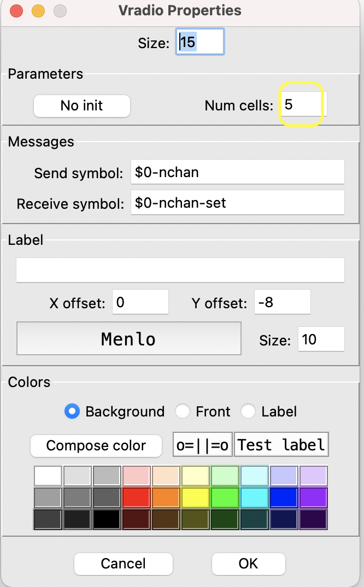
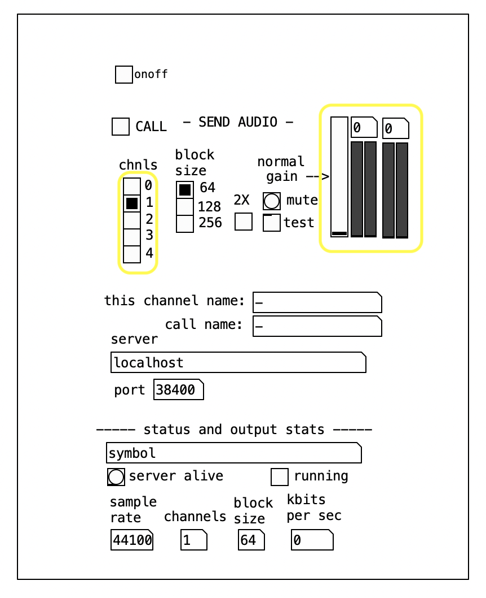
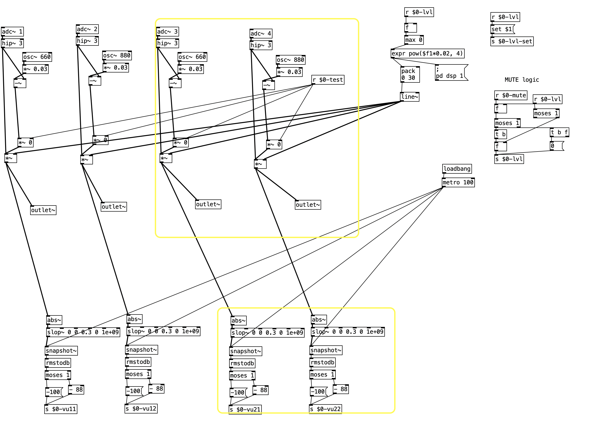
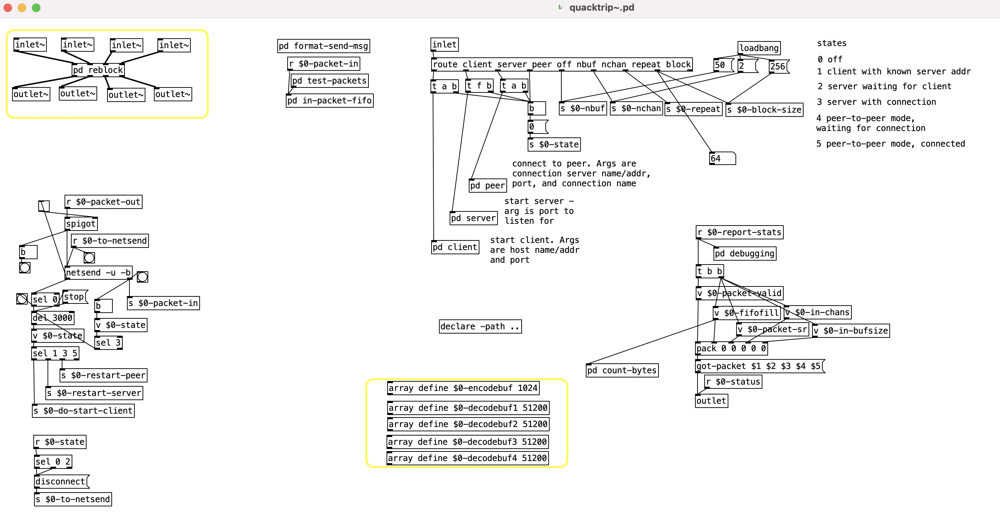
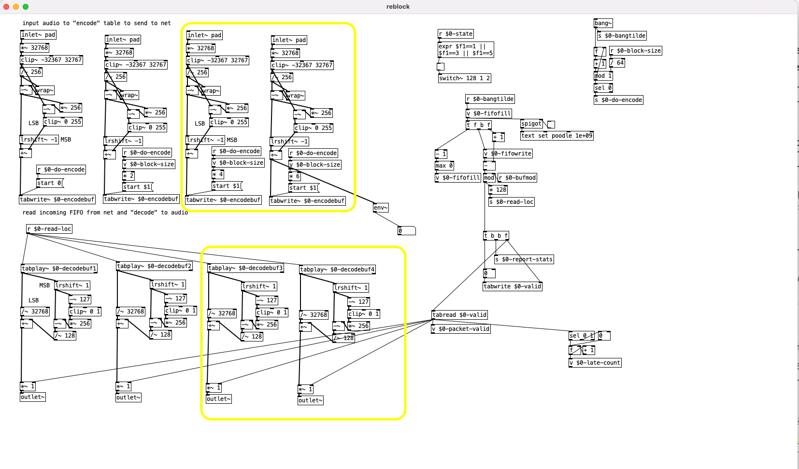
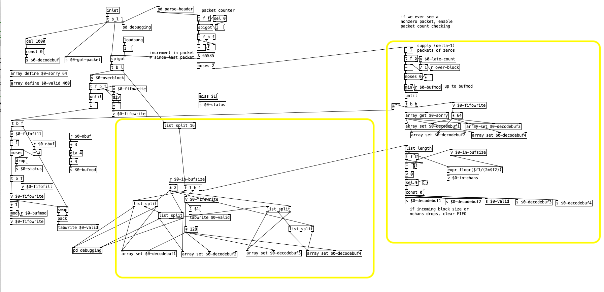
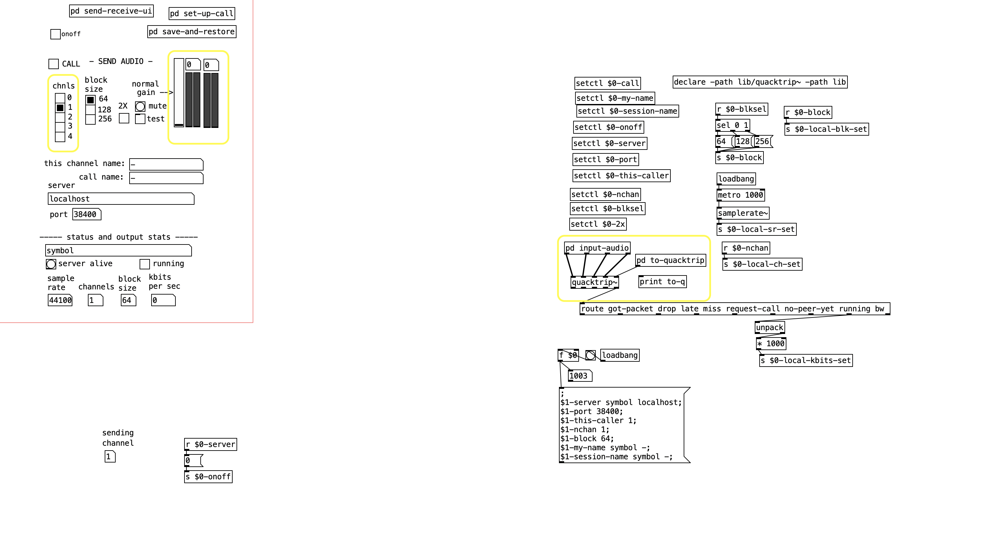
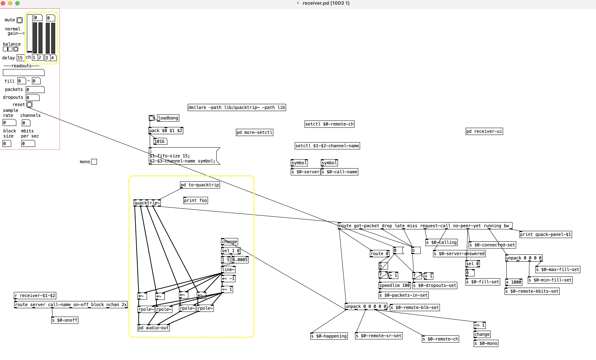
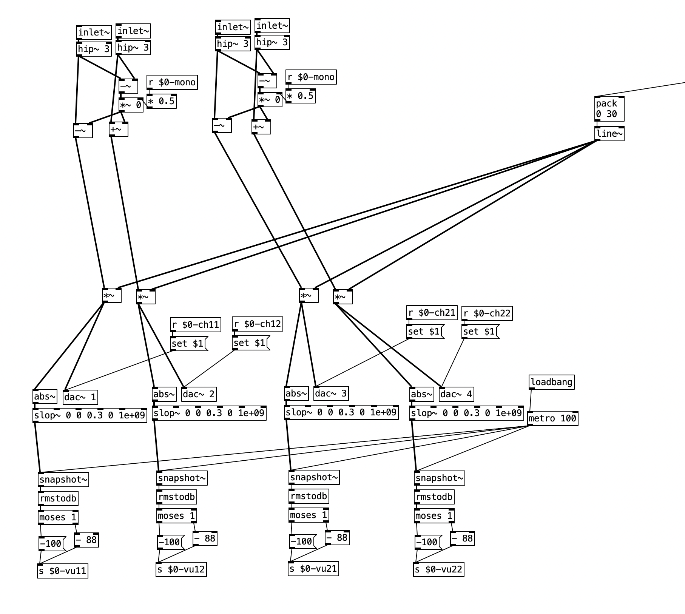
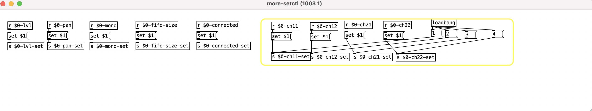

## Purpose

By default, Netty supports 2 channel audio send and receive. 
This document describes the changes made to the Netty patch to support **4 channel audio send and receive**.

## List Of Changes

### Changes to `main_panel` -

1.
   * Change number of cells to `5` for the `chnls` selector -  
   * Change the `Receive Symbol` for the VU meter to `$0-vu11`, `$0-vu12` for the 1st stereo pair and then copy the stereo VU meter to create a new pair and name the `Receive Symbol`
to `$0-vu21` and `$0-vu22` - these will be used to display the outgoing 4 channel audio levels (from earlier 2 channels).
     

2. Change to `pd input-audio` sub-patch to accept 4 channels inside `main_panel` -

3. Changes to `quacktrip~` sub-patch inside `main_panel` - 

* Add 4 channel in/out to `pd reblock` patch - this sub-patch is used to write the audio channels in an encoded packet to be sent to the network and also decode incoming packet.  
  
* Add audio buffers for the incoming audio buffer - we need 1 for each channel.
* Changes to the `pd in-packet-fifo` patch - the changes are primarily to make sure we read the incoming packet at the right offset and then use that decode it- 

**NOTE:** Limited explanation for changes here - the first `16` bytes are the header and then the rest is the packet, each channel being `128` bytes in length (assuming a default block-size of `64`).
The changes on the right side are for counting the packets for each of the incoming channels.

The `main_panel` should look like this for the `quacktrip~` 

### Changes to `receiver` sub-patch

1. Change the `Receive Symbol` for the VU meter to `$0-vu11`, `$0-vu12` for the 1st stereo pair and then copy the stereo VU meter to create a new pair and name the `Receive Symbol` to `$0-vu21` and `$0-vu22` - these will be used to display the incoming 4 channel audio levels (from earlier 2 channels). (Similar to the `main_panel` changes)

2. Change `pd audio-out` sub-patch to accept 4 inlets of audio 

**NOTE:** The changes here treat the stereo pairs each as 1 set i.e. 2 pairs of stereo for the 4 channel output.  When the `mono` setting is triggered, the 4 channel setup becomes `stereo` as we have 1 channel coming out per pair of channels. 

3. Connect 4 outlets from `quacktrip~` to the `pd audio-out` as show in the image before the receiver changes.
4. Set the default channel numbers for the `receiver` in `pd more-setctl` sub-patch - 

