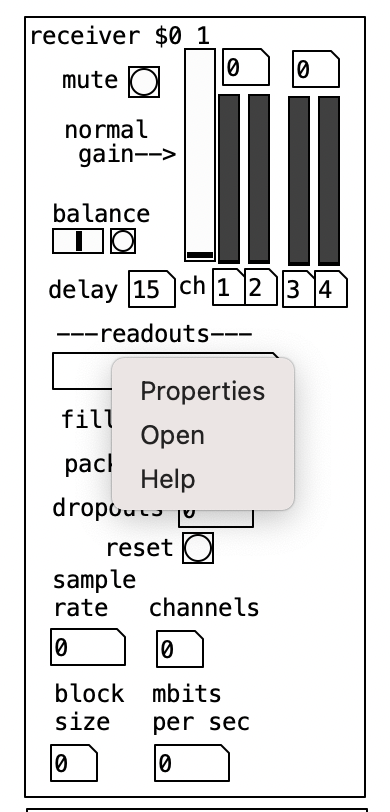

## Purpose

This document describes the changes made to the Netty patch to support UI controls from the Electron (desktop) app.

The source code for the Electron app is located here - https://github.com/FrailWords/part-ui. To read more about how to
build and run the Electron app, check the readme in that repository.

## List Of Changes

1. Add sender and receiver OSC UDP configurations and corresponding routes in the `main-panel` - open main panel -

2. Add `pd send-receive-ui` sub-patch as here -

3. Add send (port `4444`) and receive (port `3333`) OSC UDP connections - all are binary receivers and senders.

All receiver values are sent on indexed path names. For e.g. receiver at index 1 would be sent to `/receiver1` OSC path and receiver at index 2 would be sent to `/receiver2` path and so on.

4. Open `receiver` sub-patch

5. As per image below, we have to make 3 changes -

* Set properties of `reset` button (to reset packet count) 
* Add `s $0-happening` to the `got-packet` route of the `route` outlet (first outlet) - this is used to check if the
  connection is active or not. When we stop receiving packets on a particular receiver for a few seconds, we consider it
  disconnected.
* Add `pd receiver-ui` sub-patch.  It sends out a packet every metro `500` millisecond with the values of the "index" of the receiver, the sub-patch number in Pd and the channel name of the receiver.  The sub-patch number is required to send back values to the correct receiver.

## Verify changes

You can verify the changes by running the Electron app from `part-ui` repository on the same laptop/computer and see if
you are able to control/change values from the other app for both the `main_panel` and any active `receiver`.

**NOTE:** inactive receivers (the ones that are disconnected and not receiving packets) are not considered for controls.
